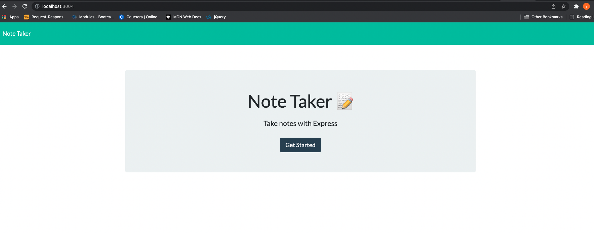
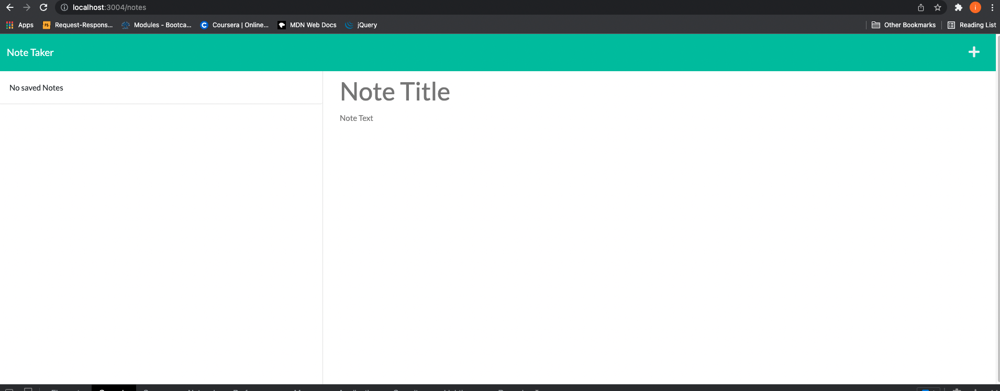
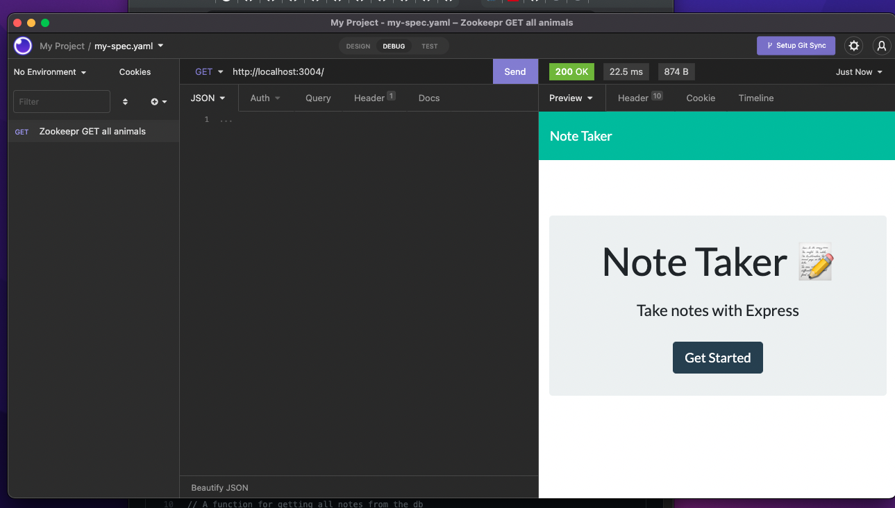
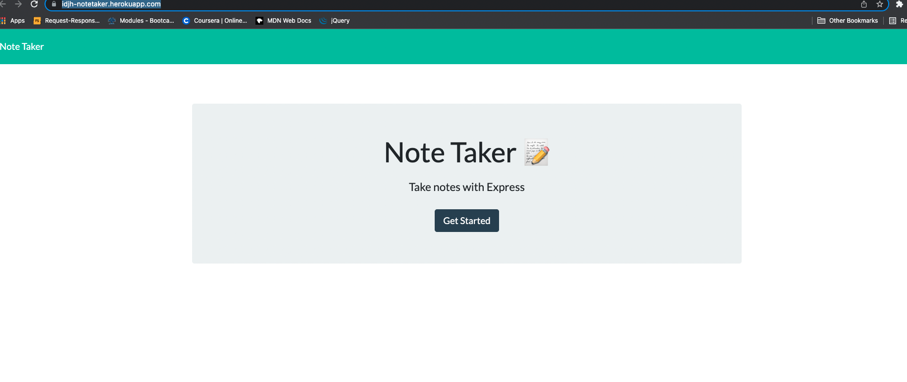

## Project Title: 
<h1 align="center">Note Taker </h1>

## Description:

🔍 An Express.js based application that enable the user to take and save notes. 

## Table of Contents
- [Description](#description)
- [Installation](#installation)
- [Usage](#usage)
- [License](#license)
- [Contributing](#contributing)
- [Tests](#tests)
- [Questions](#questions)

## Installation
💾  Download or Clone File then npm install express
    

## Usage
💻  after download and install ,
using local host: 

using insomnia: 

using deployed application in the cloud:

Heroku link : https://idjh-notetaker.herokuapp.com/

Built with:

- HTML
- CSS
- Bootstrap 
- Javascript
- Node 
- Express

## Credits 
👪 Made by Irene with the help TA's, instructor @Trilogy,  jcw2865 and GOOGLE. 

